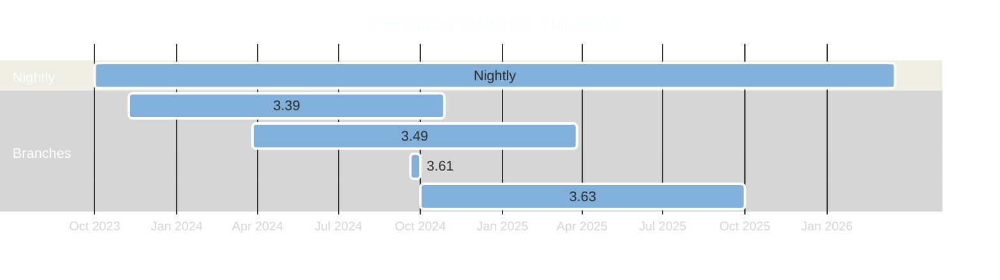

# Pulpcon - 2024

## Packaging Pulp RPMs

---
layout: intro
---

# whoami

- Odilon Sousa
  - Senior Software Engineer at Red Hat
  - Primarily working with RPM packagingr
    - Foreman/Katello/Pulp

---

# This year recap

<div grid="~ cols-2 gap-2" m="-t-2">
<div v-click>

- Automations
  - Dependabot 🤖
  - Auto Packaging after Dependabot Merge
  - Dependecy Resolution in Dependabot PRs
  - Auto Bump of all required libs two times in the week

</div>

<div v-click>

- Packaged Versions
  - Nightly - Based on last supported for Katello
  - 3.49
  - 3.61 - For Weeks
  - 3.63

</div>
</div>

---

# Timeline

<div v-click>

* 2 Active numbered releases and nightly being updated by Dependabot
* At some point next year we plan to add dependabot based workflow to branched releases
* Starting with 3.63 we only build for EL9, until EL10 release 😏

</div>

<div v-click>



</div>

---

# Building Information

<div grid="~ cols-2 gap-2" m="-t-2">
<div>

- Which Build Systems are support?
  - Setuptools
  - Poetry
  - Maturin
  - Flit
  - Hatch

</div>

<div>

* Only Python 3.11 is supported now
  * Until EL10 - Rebuild for 3.12

* We have bi-weekly builds of libs
  * Catching breakeages ealier in the process
  * Changing from setup.py/cfg to PEP-517? 
    * We catch that weekly now


</div>
</div>

---

# How fast can we go?

* New Pulp bits being released in hours
  * Pulpcore 3.63.1 Release
    * Upstream Pulp - [Released](https://github.com/pulp/pulpcore/commit/570950de0aa6c262e99b33792913a706a671fc5c) Wed Oct 30 15:46:51 2024
    * Dependabot - [Released](https://github.com/theforeman/pulpcore-packaging/commit/231f789dfd3490b84bb52a91f70aadeabe058889) Wed Oct 30 17:18:12 2024
    * Packaging - [Released](https://github.com/theforeman/pulpcore-packaging/pull/1419) Wed Oct 30 17:24:06 2024
    * Released on Nightly - [Released](https://copr.fedorainfracloud.org/coprs/g/theforeman/pulpcore-nightly-staging/build/8191052/) Wed Oct 30 17:44 2024


---

# Why support PEP-517

<div grid="~ cols-2 gap-2" m="-t-2">


<div>

New packages don't know about setup.py, <b>pyproject.toml </b> is the new kid on the block

To keep building with only setuptools we had to inject a <b>setup.py</b> in the specfile

```bash
# create a minimal setup.py, the rest will 
# be done by setuptools
printf 'from setuptools import setup\nsetup()' > setup.py

or 

# Force setuptools_scm usage for older setuptools
sed -i 's/setuptools.setup.*/setuptools.setup(use_scm_version=True)/' setup.py
```


</div>

<div>

What's necessary to support all packages that implement PEP-517 on Pulp

- Hatch build system
- Flit build system
- Poetry build system
- And a lot of circular dependency


</div>


</div>

---

# How we built the support?

<div grid="~ cols-2 gap-2" m="-t-2">

<div>

python-tomli is the most important package to start, since it's the TOML parser, the problem it only have support for <b> pyproject.toml </b>

We had to inject a <b>setup.py</b> for the last time

<div style="width:480px"><iframe v-click class="absolute  w-80 opacity-110" allow="fullscreen" frameBorder="0" height="200" src="https://giphy.com/embed/BkRNtZvoIywTaQT2mh/video" width="480"></iframe></div>

</div>

<div v-click>

- pipdeptree and pipgrip was heavily used to solve dependecy
- 45+ new packages added
- pyproject-rpm-macros ported from Fedora to add the necessary macros

</div>

</div>
---

<div grid="~ cols-2 gap-2" m="-t-2">
<div>

Packaging structure with setup.py

```bash
%prep
set -ex
%autosetup -n %{pypi_name}-%{version}
rm -rf %{pypi_name}.egg-info

%build
set -ex
%py3_build

%install
set -ex
%py3_install

%files -n %{?scl_prefix}python%{python3_pkgversion}-%{pypi
_name}
%license LICENSE
%doc README.rst
%{python3_sitelib}/%{pypi_name}
%{python3_sitelib}/%{pypi_name}-%{version}-py%{python3_ver
sion}.egg-info
```

</div>

<div v-click>

Packaging structure with PEP-517

```bash
%prep
set -ex
%autosetup -n %{pypi_name}-%{version}

%build
set -ex
%pyproject_wheel

%install
set -ex
%pyproject_install

%files -n python%{python3_pkgversion}-%{pypi_name}
%{python3_sitelib}/opentelemetry
%{python3_sitelib}/%{pypi_name}-%{version}.dist-info/
```

</div>


</div>

---

# RPM Develop aka nightly

- Help us during branch for Katello
- Not build from one older version to one new version
  - Try to keep up to date with Pulp and branch when necessary for Katello
- Test new releases with Katello development
  - Help identifying possible regression and blockers
- Automation! Automation! Automation
  - Create one automation that can read the list of dependencies of Pulp and check if it needs <b>setup.py</b> or <b>pyproject.toml</b>
    - Use the right tool to add or update the specfile

---

# Building packages with COPR

<div grid="~ cols-2 gap-2" m="-t-2">

<div>

Until now all RPMs got build at koji.katello.org

Maintaining our own koji demands a lot time and work

COPR Provides RHEL 8 and RHEL 9 buildroots

We can still scratch to test packages

We still use <b>obal</b> to build/scratch/lint our packages

How do we enable copr on packaging?

</div>

<div v-click>
<sub>

```yaml
copr_projects:
  vars:
    core_modules:
      - 'python39:3.9'
      - 'ruby:2.7'
    rhel_9: '9'
    rhel_8: '8'
    root_repo_url: 
  hosts:
    pulpcore-copr:
      copr_project_name: 
      copr_project_chroots:
        - name: "rhel-{{ rhel_8 }}-x86_64"
          modules: "{{ core_modules }}"
          comps_file: 
          buildroot_packages:
            - gcc-c++
            - python39-rpm-macros
          external_repos:
            - "{{ pulpcore_staging }}/rhel-{{ rhel_8 }}-x86_64"
```
</sub>
</div>
</div>
https://github.com/theforeman/obal

https://github.com/theforeman/pulpcore-packaging/blob/rpm/develop/package_manifest.yaml#L44

---

# Pulpcore Nightly 

<div grid="~ cols-2 gap-2" m="-t-2">

<div>


https://ci.theforeman.org/blue/organizations/jenkins/pulpcore-nightly-rpm-pipeline/

</div>


<div>

<sub>

https://copr.fedorainfracloud.org/coprs/g/theforeman/pulpcore-nightly-staging/

<br><br>


https://copr.fedorainfracloud.org/coprs/g/theforeman/pulpcore-nightly-staging-scratch-b26856ba-3c9d-5535-9bf7-f474701e8e4c/

</sub>

</div>

</div>

---
layout: center
---

# Questions?