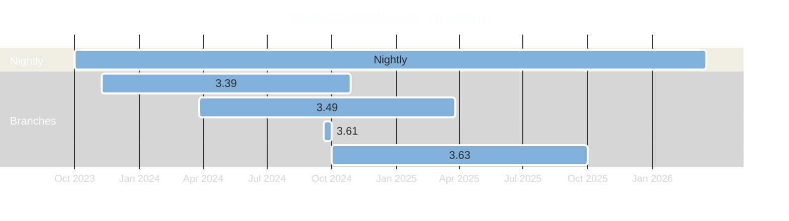

# Pulpcon - 2024

## Packaging Pulp RPMs

---
layout: intro
---

# whoami

- Odilon Sousa
  - Senior Software Engineer at Red Hat
  - Primarily working with RPM packagingr
    - Foreman/Katello/Pulp

---

# This year recap

- Automations
  - Dependabot 🤖
  - Auto Packaging after Dependabot Merge
  - Dependecy Resolution in Dependabot PRs
  - Auto Bump of all required libs two times in the week

- Packaged Versions
  - Nightly - Based on last supported for Katello
  - 3.49
  - 3.61 - For Weeks
  - 3.63

---

# Timeline

* 2 Active numbered releases and nightly being updated by Dependabot
* At some point next year we plan to add dependabot based workflow to branched releases
* Starting with 3.63 we only build for EL9, until EL10 release 😏

---

# Building Information

- Which Build Systems are support?
  - Setuptools
  - Poetry
  - Maturin
  - Flit
  - Hatch

* Only Python 3.11 is supported now
  * Until EL10 - Rebuild for 3.12

* We have bi-weekly builds of libs
  * Catching breakeages ealier in the process
  * Changing from setup.py/cfg to PEP-517? 
    * We catch that weekly now

---

# How fast can we go?

* New Pulp bits being released in hours
  * Pulpcore 3.63.1 Release
    * Upstream Pulp - [Released](https://github.com/pulp/pulpcore/commit/570950de0aa6c262e99b33792913a706a671fc5c) Wed Oct 30 15:46:51 2024
    * Dependabot - [Released](https://github.com/theforeman/pulpcore-packaging/commit/231f789dfd3490b84bb52a91f70aadeabe058889) Wed Oct 30 17:18:12 2024
    * Packaging - [Released](https://github.com/theforeman/pulpcore-packaging/pull/1419) Wed Oct 30 17:24:06 2024
    * Released on Nightly - [Released](https://copr.fedorainfracloud.org/coprs/g/theforeman/pulpcore-nightly-staging/build/8191052/) Wed Oct 30 17:44 2024

---

---
layout: center
---

# Questions?