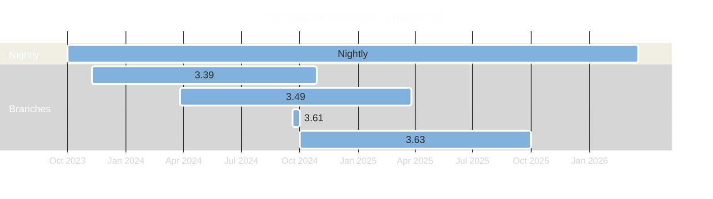

# Pulpcon - 2024

## Packaging Pulp RPMs

---
layout: intro
---

# whoami

- Odilon Sousa
  - Senior Software Engineer at Red Hat
  - Still working with RPM packaging
    - Foreman/Katello/Pulp

---

# This year recap

<div grid="~ cols-2 gap-2" m="-t-2">
<div v-click>

- Automations
  - Dependabot 🤖
  - Auto Packaging after Dependabot Merge
  - Dependecy Resolution in Dependabot PRs
  - Auto Bump of all required libs two times in the week

</div>

<div v-click>

- Packaged Versions
  - Nightly - Based on last supported for Katello
  - 3.49
  - 3.61 - For 3 Weeks
  - 3.63

</div>
</div>

---
layout: center
---
# Timeline

<div v-click>

* 2 Active numbered releases and nightly being updated by Dependabot
* At some point next year we plan to add dependabot based workflow to branched releases
* Starting with 3.63 we only build for EL9, until EL10 release 😏

</div>

<div v-click>



</div>

---

# Building Information

<div grid="~ cols-2 gap-2" m="-t-2">
<div v-click>

- Supported Build Systems
  - Setuptools
  - Poetry
  - Maturin
  - Flit
  - Hatch

</div>

<div v-click>

* Only Python 3.11 is supported now
  * Until EL10 - Rebuild for 3.12

* We have bi-weekly builds of libs
  * Catching breakeages ealier in the process
  * Changing from setup.py/cfg to PEP-517? 
    * We catch that weekly now


</div>
</div>

---

# How fast can we go?

<div grid="~ cols-2 gap-2" m="-t-2">
<div v-click>


* New Pulp bits being released in hours
  * Pulpcore 3.63.1 Release
    * Upstream Pulp - [Released](https://github.com/pulp/pulpcore/commit/570950de0aa6c262e99b33792913a706a671fc5c) Wed Oct 30 15:46:51 2024
    * Dependabot - [Released](https://github.com/theforeman/pulpcore-packaging/commit/231f789dfd3490b84bb52a91f70aadeabe058889) Wed Oct 30 17:18:12 2024
    * Packaging - [Released](https://github.com/theforeman/pulpcore-packaging/pull/1419) Wed Oct 30 17:24:06 2024
    * Released on Nightly - [Released](https://copr.fedorainfracloud.org/coprs/g/theforeman/pulpcore-nightly-staging/build/8191052/) Wed Oct 30 17:44 2024

</div>

<div v-click>>


</div>

</div>

---

# Auto Update

<div grid="~ cols-2 gap-2" m="-t-8">
<div v-click>


* Workflow based update on GitHub
  * Installs Pulp from [automation/requirements.txt](https://github.com/theforeman/pulpcore-packaging/blob/rpm/develop/automation/requirements.txt)
  * Detects what is packaged
    * if one lib is out of date a PR will be created
  * Creates Jobs using a Matrix with updated libs
    * The PRs runs one Scratch Build against nightly
  * 150+ PRs created and merged since - Sep 10 2024
</div>

<div v-click>


</div>
</div>


---

# Using dependabot to automate Pulp Builds

<div grid="~ cols-2 gap-2" m="-t-2">
<div v-click>

* Dependabot tracks the current branched version of Pulp
  * Runs daily or ad-hoc
  * Creates one new PR
    * Tests using github-actions
  * After Merge one workflow auto bump the specfile.


</div>


<div v-click>

```yaml  
    groups:
       pulp-cli-deps:
          applies-to: version-updates
          patterns:
            - "pulp-cli"
            - "pulp-glue"
       pulp-cli-deb-deps:
          applies-to: version-updates
          patterns:
            - "pulp-cli-deb"
            - "pulp-glue-deb"
    labels:
      - "dependabot"
    ignore:
      - dependency-name: "pulpcore*"
        update-types: ["version-update:semver-minor"]
      - dependency-name: "pulp-rpm*"
        update-types: ["version-update:semver-minor"]
      - dependency-name: "pulp-ostree"
        update-types: ["version-update:semver-minor"]
```

</div>

</div>


---
layout: center
---
# Cool Stats

* Dependabot created 62 Commits since April of 2024
  * Dependabot is now on 3rd place after **packaging@theforeman.org** that holds **183** commits against **rpm/develop**
* boto3/botocore and grpcio releases weekly and this makes **packaging@theforeman.org** stats inflated.
* We got 83 packages using **%pyproject_install** aka not tied to setup.py/cfg.


---
layout: center
---

# Plans for next year

* Move packaging scratch and release out of Jenkins.
* Add Dependabot workflow to supported releases like 3.49/3.63.
* Rebuild on top of Python 3.12
* Use [Rich Dependencies](https://docs.fedoraproject.org/en-US/packaging-guidelines/Python/#Automatically-generated-dependencies) as much as possible

---

# Questions?